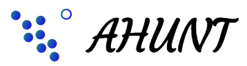

# ahunt-pipelin
Active learning HUman in the loop aNomaly deTection. 



## Installation

```
git clone https://github.com/vafaei-ar/ahunt-app.git
cd ahunt-app
conda env create -f environment.yml
conda activate ahunt
python setup.py install
ahunt 8501
```

